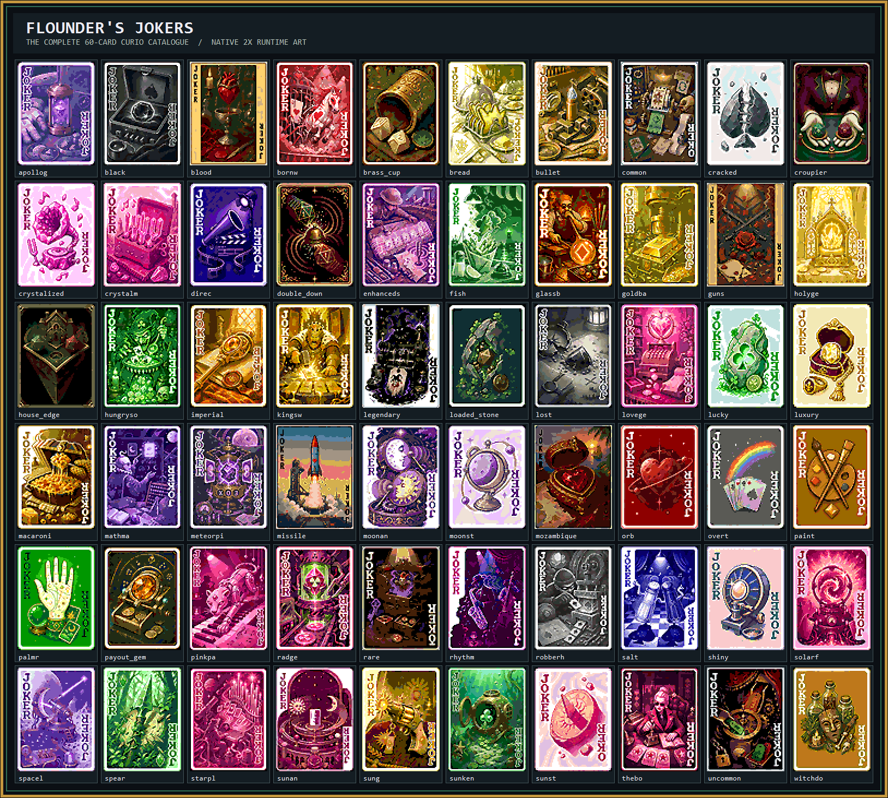

<div align="center">

<picture>
  
</picture>

<h1>Flounder’s Jokers</h1>

<h3>Definitive Edition · Curio Circuit 3.0</h3>

**Sixty creator-faithful Jokers. Canonical Dice Seals. A complete native progression chapter.**

[](CHANGELOG.md)
[](https://github.com/Steamodded/smods)
[](docs/RELEASE_CERTIFICATION.md)
[](ART_DIRECTION.md)

<p>The creator-faithful, production-grade edition of Flounder’s Balatro work—preserving the complete original catalogue and its logic while finishing the visual, audio, compatibility, and progression layers around it.</p>

<p>
  <kbd>60 JOKERS</kbd>&nbsp;
  <kbd>2 DICE SEALS</kbd>&nbsp;
  <kbd>3 DECKS</kbd>&nbsp;
  <kbd>4 BOSS BLINDS</kbd>&nbsp;
  <kbd>4 VOUCHERS</kbd>&nbsp;
  <kbd>6 CHALLENGES</kbd>
</p>

</div>

---

<div align="center">
  <a href="#the-definitive-pack"><b>Catalogue</b></a> ·
  <a href="#what-remains-exactly-flounders"><b>Preservation</b></a> ·
  <a href="#canonical-dice-mechanics"><b>Dice</b></a> ·
  <a href="#progression-chapter"><b>Progression</b></a> ·
  <a href="#visual-and-effects-direction"><b>Presentation</b></a> ·
  <a href="#requirements-and-installation"><b>Install</b></a> ·
  <a href="#verification"><b>Verify</b></a>
</div>

<br>



## The definitive pack

<table>
  <tr>
    <td align="center" width="25%"><strong>Creator catalogue</strong><br><sub>54 original calculation bodies retained</sub></td>
    <td align="center" width="25%"><strong>Canonical expansion</strong><br><sub>6 Dice-suite Jokers + both Seals</sub></td>
    <td align="center" width="25%"><strong>Progression</strong><br><sub>17 native 3.0 gameplay objects</sub></td>
    <td align="center" width="25%"><strong>Presentation</strong><br><sub>158 runtime PNGs + 17 injected sounds</sub></td>
  </tr>
</table>

- **60 Jokers:** all 54 original cards plus one tightly balanced six-card Dice Seal suite.
- **2 canonical animated Seals:** Dice Seal and Cursed Dice Seal, each using a measured twelve-frame atlas.
- **2 canonical Spectrals:** *Oops! All 20s* and *Oops! No 20s*.
- **120 exact Joker sprites:** bespoke `71×95` art and pixel-perfect `142×190` companions.
- **3 decks, 4 Boss Blinds, 4 Vouchers, and 6 challenges:** a focused discovery-and-mastery layer, available immediately.
- **14 mastered sound families:** every Joker and progression object receives an intentional cue, with strict codec, duration, loudness, peak, and uniqueness validation.
- **Current packaging:** JSON metadata, collision-safe `fj` keys, current Atlas/Seal/Consumable/Sound APIs, and the official Steamodded legacy adapter around the creator’s original Joker calculations.
- **Release QA:** named card ledger, syntax checks, art/frame validation, RNG isolation, metadata validation, audio completeness gates, and a clean isolated launch on the certified compatibility matrix.

> [!IMPORTANT]
> Version 3.0 adds systems around the catalogue; it does not rebalance or replace the creator’s original 54 Joker calculation bodies. The six canonical Dice-suite Jokers also retain their established 2.1 behavior.

## What remains exactly Flounder’s

The 54 original cards retain their internal keys, rarities, prices, odds, suit checks, scoring contexts, retrigger behavior, enhancement behavior, dependency gates, and creator-authored family structure. Historical internal spellings remain intact for save compatibility; only player-facing spelling is corrected.

The remaster deliberately does **not** flatten the pack into easier unconditional bonuses. Chance cards still ask for chance. Suit cards still ask for suit construction. Creator cards still respect consumable space. Optional suit families still require the mods that define those suits.

An exact pre-migration snapshot is preserved in [`archive/legacy-code`](archive/legacy-code), and the original visual assets remain in [`archive/original-assets`](archive/original-assets).

## Canonical Dice mechanics

| Object | Effect |
|---|---|
| Dice Seal | Discarding it doubles all listed probabilities, then removes every Dice Seal from the deck. |
| Cursed Dice Seal | Discarding it halves all listed probabilities, then removes every Cursed Dice Seal from the deck. |
| Oops! All 20s | Applies a Dice Seal to exactly one selected card. |
| Oops! No 20s | Applies a Cursed Dice Seal to exactly one selected card. |

The legacy mini-mods achieved those effects by replacing pack opening, collection UI, consumable use, controller input, sprite setup, and seal calculation globally. This edition expresses the same mechanics as native Steamodded objects, so Standard Packs and other mods retain control of their own systems.

## The Dice suite

| Joker | Role | Balance constraint |
|---|---|---|
| Loaded Stone | Chance XMult | Requires a scored sealed card and a successful 1-in-4 roll. |
| Brass Cup | Chips | Requires sealed scoring cards. |
| Payout Gem | Economy | Pays only from sealed scoring cards. |
| House Edge | Conditional XMult | Requires both lucky and cursed seal types in one scoring hand. |
| Double Down | Retrigger | Retriggers only sealed scoring cards. |
| The Croupier | Deck shaping | Non-Blueprint 1-in-6 chance; creates either a blessing or a curse. |

This mirrors the creator’s stone / tool / gem / value / retrigger / transformer rhythm while making the Dice Seals part of an actual deck-building ecosystem.

## Progression chapter

<picture>
  
</picture>

<div align="center"><sub>A discovery-first exhibit: everything is visible immediately; mastery supplies the progression.</sub></div>

<br>

| Type | Content | Purpose |
|---|---|---|
| Decks | Loaded, Workshop, Curator | Enter through Dice risk, a family starter, or collection weighting. |
| Vouchers | Wax Stamp → Sealing Press | Add controlled seal guarantees to Standard Packs without increasing pack size. |
| Vouchers | Display Case → Private Collection | Deepen Flounder-focused shops, then edition-curate one offer per Ante. |
| Boss Blinds | Quarry, Lock, House, Mirror | Test enhancements, play order, probability control, and repeated ranks. |
| Challenges | First Roll through Grand Exhibition | Six immediately available mastery runs, ordered from tutorial to capstone. |

Curator and Display Case use Steamodded's native object-weight context and stack multiplicatively to X3. Private Collection excludes Negative editions. The House stores and restores its exact incoming probability numerator on defeat or disable. All run state lives under `G.GAME.fj_progression`.

## Visual and effects direction

Repeated placeholders were replaced with mechanic-specific still lifes and scenes. Every card keeps the recognizable vertical frame language, but its subject, silhouette, materials, lighting, and prop story are individual. Dice Seal tokens use a 12-frame squash/stretch, settle, and traveling-glint cycle rather than a global shader hook, so editions and other render effects remain compatible. Balatro's Reduced Motion setting freezes the added seal animation and suppresses presentation-layer movement.

Successful effects use layered, readable feedback:

1. the native score or status message;
2. restrained card juice, a 320 ms edition-safe native draw-step glint, and one semantic pixel mote following a damped ballistic arc at the actual success point;
3. one family sound with a stable per-card pitch fingerprint;
4. a 90 ms per-card cooldown plus a measured 180 ms shared voice budget, keeping simultaneous triggers clear without silencing them.

The Steamodded mod page includes accessibility controls for card sound cues and kinetic trigger effects. These controls never alter scoring or card logic, and Balatro's global Reduced Motion setting always takes priority.

<details>
<summary><strong>View the progression runtime QA board</strong></summary>

This board shows the reduced in-game-scale art rather than the high-resolution source, including deck backs, Boss Blind emblems, and both Voucher chains.


</details>

See [`ART_DIRECTION.md`](ART_DIRECTION.md), [`audio/SFX_DIRECTION.md`](audio/SFX_DIRECTION.md), and [`docs/AUDIO_MASTERING_REPORT.md`](docs/AUDIO_MASTERING_REPORT.md) for the visual system, sound bible, measured band/loudness audit, and ten-cue spectrogram sheet.

## Requirements and installation

<table>
  <tr>
    <td align="center" width="33%"><strong>1 · Loader</strong><br><sub>Lovely 0.9.0+</sub></td>
    <td align="center" width="33%"><strong>2 · Framework</strong><br><sub>Steamodded beta-1800+</sub></td>
    <td align="center" width="33%"><strong>3 · Mod</strong><br><sub>One complete FloundersJokers folder</sub></td>
  </tr>
</table>

1. Install Balatro with Lovely and **Steamodded 1.0.0-beta-1800 or newer**.
2. Copy this entire folder into Balatro’s `Mods` directory as one folder.
3. Confirm the final path contains `flounderjokers.json`, `main.lua`, `modules`, and `assets` directly beneath it.
4. Launch Balatro and open **Mods → Flounder’s Jokers** to confirm version `3.0.0`.

Do not install `Dice-Seals-main` separately; it is preserved only as source history and is already part of the definitive pack.

> [!NOTE]
> 3.0 includes a conservative migration for in-progress vanilla saves created before Steamodded added scoring-calculation, hand-limit, CardArea, PokerHand, and permanent-bonus fields. It fills only missing fields with vanilla defaults and never rewrites an existing modded value. No user-specific Steamodded edits are bundled or required.

Optional collaboration families appear only when their defining mods are present: Codex Arcanum, MoreFluff, Reverie, Musical Suit, Crowns Suit, and SixSuit.

<details>
<summary><strong>Clean upgrade from 2.1</strong></summary>

Replace the complete old mod folder with the 3.0 folder. Do not merge folders and do not install the archived Dice mini-mod separately. Existing Joker keys and historical internal spellings are retained for save compatibility.

</details>

<details>
<summary><strong>Expected folder layout</strong></summary>

```text
Balatro/Mods/FloundersJokers/
├── flounderjokers.json
├── main.lua
├── FloundersJokers.lua
├── assets/
├── audio/
├── modules/
└── docs/
```

</details>

## Verification

Run the full release gate from PowerShell:

```powershell
.\tools\qa-release.ps1
```

The gate requires all 60 Joker art pairs, both animated seals, all progression objects and six-frame atlases, all 14 audio masters, valid metadata, isolated RNG, safe state restoration, and parseable Lua. See [`docs/CARD_AUDIT.md`](docs/CARD_AUDIT.md), [`docs/BALANCE_PLAN.md`](docs/BALANCE_PLAN.md), and [`docs/RELEASE_CERTIFICATION.md`](docs/RELEASE_CERTIFICATION.md).

To rebuild the gallery or seal animation sheets:

```powershell
.\tools\build-gallery.ps1
.\tools\build-seal-animation.ps1 -SourceName dice_seal.png -OutputName dice_seal_animated.png
```

To securely generate audio, run the interactive finalizer. It hides keyboard input, keeps the credential only in the current process, generates and masters every cue, runs strict QA, emits the release ZIP, then clears the credential:

```powershell
.\tools\finalize-release.ps1
```

The generator uses ElevenLabs `eleven_text_to_sound_v2`, keeps credentials out of the repository, trims every cue to the same loudness target, high/low-passes the masters, and exports Steamodded-ready OGG files.

## Credits and provenance

<table>
  <tr>
    <td width="50%"><strong>Creator authority</strong><br>Original cards, identities, mechanics, keys, family logic, and Dice Seal concepts belong to Flounder.</td>
    <td width="50%"><strong>Definitive-edition craft</strong><br>Migration, remastered production assets, progression presentation, audio mastering, QA tooling, and documentation serve that original work.</td>
  </tr>
</table>

No new license is asserted. Distribution rights and attribution remain subject to the original creator’s terms.

---

<div align="center">

**Built as a preservation-first finishing pass for Flounder’s original work.**

Technical release certification is not a claim of creator endorsement; public “official” status remains Flounder’s decision.

</div>
